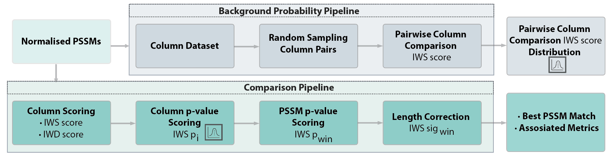

# CompariPSSM

CompariPSSM quantifies the similarity between short linear motifs (SLiMs) using sliding window PSSM-PSSM (Position Specific Scoring Matrix) comparison and scores PSSM similarity using a randomisation-based probabilistic framework. CompariPSSM can be used for peptide classification against lists of validated motif classes, peptide clustering to group functionally related conserved disordered regions, and benchmarking of experimental motif discovery methods. The CompariPSSM pipeline can also screen motif binding determinant models against protein alignments using PSSM-PSSM comparison thereby including residue conservation, a strong discriminator of motif functionality, directly into in silico motif discovery.

## Table of contents
* [Description](#PSSM-PSSM-Comparison-Approach)
* [CompariPSSM Web server](#CompariPSSM-Web-server)
* [Usage](#usage)
* [Input files](#input-files)
* [Output files](#output-files)
* [License](#license)
* [Reference](#reference)

## PSSM-PSSM Comparison Approach
The CompariPSSM framework is a pipeline for comparing motif binding determinants encoded as PSSMs. The framework integrates information on PSSM column similarity, scored using Pearson's Correlation Coefficient, and the PSSM column importance, scored using the Gini Coefficient, to align the PSSMs and calculate a similarity score for the best alignment. The CompariPSSM pipeline includes two major steps (Figure 1): (i) the Background Probability Pipeline that calculates the likelihood of pairwise PSSM column Importance-Weighted Similarity (IWS) score using a randomisation-based probabilistic framework, and (ii) the Comparison Pipeline which aligns PSSM pairs using a sliding window approach to define the optimal PSSM-PSSM alignment and applies information from the Background Probability Pipeline to calculate the likelihood of such an alignment occurring by chance. An additional Importance-weighted Dissimilarity (IWD) score that identifies important positions in the query PSSM that are not present in the corresponding position of the comparison PSSM is also calculated in parallel to the IWS score calculation, to discriminate between similar but non-identical motif binding determinants. CompariPSSM takes as input a query PSSM and a set of one or more comparison PSSMs and outputs the aligned best-matching comparison PSSM to the query PSSM with a statistical measure of the likelihood of that match happening by chance.

<p align="center">
  
</p>

## CompariPSSM Web server
The CompariPSSM pipeline and interactive visualisations have been made available as a web server at https://slim.icr.ac.uk/projects/comparipssm. The CompariPSSM server has numerous input options: (i) input PSSMs, which can be copied and pasted directly in or upload a PSSM in a Tab-Delimited Table or JSON format; (ii) sets of aligned or unaligned peptides; and (iii) protein regions defined UniProt accession, gene name or protein name, and region and start and stop offsets. The query PSSM can be compared against a user-defined input PSSM or the Eukaryotic Linear Motif (ELM) resource-curated PSSM dataset. The output is the best match to the query PSSM, the comparison similarity (IWSsigwin) and dissimilarity score (max IWD score), and logos visualising the PSSM-PSSM comparison. If there is more than one significant match, additional hits are shown in a tabular form.

## Usage
```bash
python comparipssm.py --query_pssm_file ./pssm_sets/query_pssm.json --compare_pssm_file ./pssm_sets/elm_pssm.json --output_file ./pssm_sets/test.out.json 
```


## Input files
Position-specific scoring matrices (PSSMs) store models of motif binding determinants as preference scores for individual amino acids at each position within the motif. PSSMs are represented as a matrix, with L columns, where L is the length of the motif peptide and 20 rows, one for each of the standard amino acids. PSSM columns generally refer to the position of the motif and the rows to the amino acid. PSSM JSON files should have standard amino acids as keys with lists of the PSSM values for each position.

- `query_pssm_file`: .JSON file containing the query PSSM.
- `compare_pssm_file`: .JSON file containing the compare PSSM or multiple compare PSSMs.
- `output_file`: .JSON file containing the results of the PSSM-PSSM comparison.

#### PSSM file example format
```json
{
    "A": [-0.178, -0.924, -0.178, 0.474, -0.924, -0.924, 0.474, -0.924, 0.841, -0.178, -0.178], 
    "C": [-0.094, 1.707, -0.094, -0.094, -0.094, -0.094, -0.094, -0.094, -0.094, -0.094, -0.094], 
    "D": [0.403, -0.219, 0.819, -0.604, -0.604, -0.604, -0.604, -0.604, -0.219, 0.403, 1.355], 
    .
    .
    .
    "Y": [-0.137, 1.408, -0.137, -0.137, -0.137, -0.137, -0.137, 20.0, -0.137, -0.137, -0.137]
}

```

## Output files
The pipeline will produce a file with 

- `best`: The best result of the PSSM-PSSM comparison.
- `significant`: All the significant hits are reported along with the respective motif class, consensus and similarity p-value and dissimilarity score.

#### Output scores

- `raw_score`: The Importance Weighted Similarity score for PSSM - PSSM comparison.
- `p_score_adj`: Final PSSM-PSSM comparison probability. The IWS sig win probability is the final p-value for a PSSM-PSSM comparison, and it is defined as the corrected Importance Weighted Similarity window probability (IWSpwin) score. 
- `dissimilarity_scores_max`: Importance Weighted Dissimilarity (IWD) score, used to highlight the difference between motif-PSSM and the model PSSM. Calculated as the maximum normalised product of the mean absolute error and Gini coefficient across the PSSM. A lower score indicates that the identified hit is more similar to the PSSM model.
- `query_motif_re`: The consensus of the query motif.
- `compare_motif_re`: The consensus of the compare motif.

#### Output file example format
```json
{
    "query_PPxY": 
        {"best": 
            {"raw_score": 0.49891657444188475, 
            "p_score": 3.3682128176079197e-10, 
            "p_score_adj": 3.7050340993687115e-09,  
            "dissimilarity_scores_max": 0.394781248366091,  
            "query_motif_re": "[CG]TPPPPY[NV][PT][LD]", "compare_motif_re": "GTPPPPY.PL", 
            "query_offset_start": 1, "query_offset_end": 11, 
            .
            .
            .
            "compare_offset_start": 0, "compare_offset_end": 10,   
            "query_motif": "query_PPxY", "compare_motif": "compare_LIG_WW_1_compare", 
            "query_name": "PPxY", "compare_name": "LIG_WW_1_compare", 
            "compare_pssm_score_scheme": "frequency", "query_pssm_score_scheme": "frequency"}, 

        "significant": 
            {"compare_LIG_WW_1_compare": 
                {"p_score": 3.3682128176079197e-10, 
                "p_score_adj": 3.7050340993687115e-09, 
                "dissimilarity_scores_max": 0.394781248366091, 
                "query_name": "PPxY", 
                "compare_name": "LIG_WW_1_compare", 
                "compare_motif_re": "GTPPPPY.PL", 
                "query_motif_re": "[CG]TPPPPY[NV][PT][LD]"}}
        }
}
```

## License
This source code is licensed under the MIT license found in the `LICENSE` file in the root directory of this source tree.

## Reference
If you find the pipeline useful in your research, we ask that you cite our paper:
```
In preparation: 
"CompariPSSM: a PSSM-PSSM comparison tool for motif specificity determinant analysis" I. Tsitsa, I. Krystkowiak, N.E. Davey (2024) PMID:TBD
```